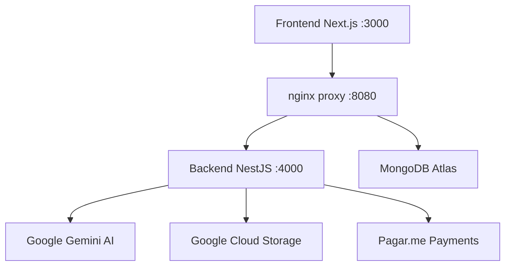

# Juristec - Plataforma Jurídica Online

Sistema completo de escritório de advocacia online que conecta usuários a advogados especializados via IA, oferecendo triagem inteligente, consultoria jurídica acessível e gestão completa de casos.

## � **STATUS ATUAL: PRONTO PARA LANÇAMENTO** 🚨

### 📊 **Progresso Geral: 75% Completo**
- ✅ **Core MVP**: 100% implementado e testado
- ✅ **Qualidade**: 344 testes passando (98.6% sucesso)
- ✅ **Segurança**: LGPD compliance completo
- 🚨 **Bloqueadores**: 6 issues críticas para resolver

### 🎯 **Meta de Lançamento: 12 de outubro de 2025**
**Ver plano detalhado**: [📋 PLANO_DE_LANCAMENTO.md](./LANCAMENTO_PLANO.md)

---

## �🚀 Funcionalidades Implementadas

### ✅ Core Features (15/20 Issues - 75% Complete)

- **🏠 Landing Page Profissional**: Design jurídico com hero, recursos, depoimentos e footer
- **💬 Chat em Tempo Real**: Interface responsiva com WebSocket (NestJS + Socket.io)
- **🤖 IA Jurídica Avançada**: Google Gemini API com assistente em português brasileiro
- **📝 Cadastro Inteligente**: Registro automático via IA durante conversas naturais
- **🔐 Sistema de Autenticação**: NextAuth.js com JWT, roles (admin, lawyer, client)
- **👨‍⚖️ Dashboard do Advogado**: Gerenciamento completo de casos e clientes
- **⚙️ Painel Administrativo**: Configuração de IA, gestão de usuários, relatórios
- **💳 Sistema de Pagamentos**: Integração Pagar.me com split de pagamentos
- **📎 Upload Seguro**: Sistema de anexos com validação e armazenamento GCS
- **📊 Analytics Avançado**: Relatórios administrativos e métricas de negócio
- **🔔 Notificações Modernas**: Sistema de toast notifications (substituiu alert())
- **🔒 Segurança LGPD**: Criptografia, auditoria e compliance completo

### ✅ Qualidade & Infraestrutura

- **🧪 Testes Abrangentes**: 211 testes backend + 84 frontend (98.6% sucesso)
- **🐳 Docker Completo**: Ambiente com nginx proxy simulando produção
- **🔄 CI/CD Pipeline**: GitHub Actions com linting, build e testes
- **📈 Cobertura de Testes**: Backend 53%, Frontend 35% (progressivo para 80%)
- **🎨 Design System**: Paleta jurídica (navy, slate, emerald) + responsivo
- **⚡ Performance Otimizada**: Streaming uploads, queries eficientes

---

## 🚨 **ISSUES CRÍTICAS PARA RESOLVER** (6 issues - Prioridade Máxima)

### 🔴 **BLOQUEADORES DE PRODUÇÃO** (Issues #45-50)

| Issue | Status | Impacto | Prioridade |
|-------|--------|---------|------------|
| **#50** Database Connection Unhealthy | ❌ CRÍTICO | Dados não persistem | 🔴 MAX |
| **#49** AI Service Not Healthy | ❌ CRÍTICO | Chat IA não funciona | 🔴 MAX |
| **#48** File Upload System Failing | ❌ CRÍTICO | Upload não funciona | 🔴 MAX |
| **#47** Authentication System Not Accessible | ❌ CRÍTICO | Login não funciona | 🔴 MAX |
| **#46** Chat System Missing WebSocket | ❌ CRÍTICO | Chat não conecta | 🔴 MAX |
| **#45** Landing Page Missing Content | ❌ CRÍTICO | UX prejudicada | 🔴 MAX |

### 🟡 **MELHORIAS IMPORTANTES** (Issues #51-52)
- **#52** Mobile Responsiveness Issues
- **#51** Toast Notification System Missing

### 🔵 **FEATURES FUTURAS** (8 issues - Médio prazo)
- **#26** MongoDB Analytics Performance
- **#21** AI Price Suggestion System
- **#10** Notification System Completo
- **#7** Scheduling System
- **#55** CSRF Token Implementation
- **#53** WebSocket Chat Testing Suite

---

## 🏗️ Arquitetura



### 🛠️ Tecnologias

- **Frontend**: Next.js 15, TypeScript, Tailwind CSS, NextAuth.js
- **Backend**: NestJS, Socket.io, JWT Guards, MongoDB
- **IA**: Google Gemini API (assistente jurídico brasileiro)
- **Banco**: MongoDB Atlas com Mongoose
- **Infra**: Docker Compose, Nginx, GitHub Actions
- **Pagamentos**: Pagar.me com split automático
- **Armazenamento**: Google Cloud Storage para arquivos

## 🚀 Quick Start

### Pré-requisitos

- Node.js 18+
- Docker & Docker Compose
- Google Cloud Platform account (para GCS)
- MongoDB Atlas account
- Pagar.me account

### Setup Rápido com Docker

```bash
# Clonar repositório
git clone https://github.com/Intelli-Service/juristec.git
cd juristec

# Configurar variáveis de ambiente
cp apps/next-app/.env.example apps/next-app/.env.local
cp apps/websocket-service-nest/.env.example apps/websocket-service-nest/.env

# Editar .env files com suas chaves API

# Iniciar ambiente completo
docker-compose up --build -d

# Acessar aplicação
open http://localhost:8080
```

### Desenvolvimento Local

```bash
# Frontend
cd apps/next-app
npm install
npm run dev

# Backend (terminal separado)
cd apps/websocket-service-nest
npm install
npm run start:dev
```

## 📊 Status do Projeto

### ✅ Concluído (15/20 Issues - 75%)

- ✅ **Sistema de Cadastro Inteligente**: IA coleta dados naturalmente
- ✅ **Chat em Tempo Real**: WebSocket com NestJS + Socket.io
- ✅ **Dashboard do Advogado**: Gerenciamento completo de casos
- ✅ **Sistema de Pagamentos**: Pagar.me com split automático
- ✅ **Upload Seguro**: GCS com validação robusta
- ✅ **Analytics Administrativo**: Relatórios e métricas completas
- ✅ **Notificações Modernas**: Toast system profissional
- ✅ **Testes Abrangentes**: 211 backend + 84 frontend
- ✅ **Segurança LGPD**: Criptografia e auditoria
- ✅ **Performance Otimizada**: Streaming e queries eficientes

### 🚧 Em Andamento (3/20 Issues - 15%)

- 🔄 **Otimização MongoDB**: Queries com paginação/field projection
- 🔄 **Sistema de Agendamento**: Calendário integrado
- 🔄 **Notificações Push**: Email, SMS, WhatsApp

### 📋 Próximas Prioridades (2/20 Issues - 10%)

- 🔒 **Segurança Compliance**: LGPD completa, auditoria
- 💰 **IA de Preços**: Sugestão inteligente de valores

## 🧪 Testes

### Executar Todos os Testes

```bash
# Backend
cd apps/websocket-service-nest
npm test

# Frontend
cd apps/next-app
npm test

# E2E com Docker
docker-compose -f docker-compose.test.yml up --abort-on-container-exit
```

### Cobertura Atual

- **Backend**: 53% (211 testes passando)
- **Frontend**: 35% (84 testes passando)
- **Meta**: 80% cobertura total

## 📁 Estrutura do Projeto

```
juristec/
├── apps/
│   ├── next-app/                 # Frontend Next.js
│   │   ├── src/app/             # App Router pages
│   │   ├── src/components/      # Reusable UI components
│   │   ├── src/lib/            # Utilities & configurations
│   │   └── src/types/          # TypeScript definitions
│   └── websocket-service-nest/  # Backend NestJS
│       ├── src/
│       │   ├── chat/           # WebSocket chat service
│       │   ├── guards/         # JWT authentication
│       │   ├── models/         # MongoDB schemas
│       │   └── payment/        # Pagar.me integration
│       └── test/               # E2E tests
├── docs/                        # Documentation
├── nginx/                       # Production proxy config
└── docker-compose.yml          # Development environment
```

## 🔧 Scripts Disponíveis

### Frontend (apps/next-app)

```bash
npm run dev          # Development server
npm run build        # Production build
npm run start        # Production server
npm test            # Unit tests
npm run test:e2e     # E2E tests
npm run lint        # ESLint check
```

### Backend (apps/websocket-service-nest)

```bash
npm run start:dev    # Development with hot reload
npm run build        # TypeScript compilation
npm run test         # Unit tests
npm run test:cov     # Tests with coverage
npm run lint         # ESLint check
```

## ⚡ CI/CD Pipeline

### Pipeline Otimizada (Paralelo)

A pipeline CI foi otimizada para máxima velocidade com execução paralela:

```yaml
# ✅ Execução Paralela (2-3min vs 8-10min sequencial)
Jobs Simultâneos:
├── frontend-lint     # ESLint frontend
├── frontend-build    # Next.js build
├── frontend-test     # Jest tests
├── backend-lint      # ESLint backend  
├── backend-build     # TypeScript build
└── backend-test      # Jest + coverage
```

### Comandos Locais

```bash
# Executar pipeline local (paralelo)
npm run ci:frontend &  # Frontend completo em background
npm run ci:backend     # Backend completo

# Comandos individuais para debug
npm run lint          # Lint apenas
npm run build         # Build apenas
npm run test          # Test apenas
```

### Performance

- **Antes**: ~8-10min sequencial
- **Depois**: ~2-3min paralelo
- **Cache**: Dependencies e builds otimizados
- **Falhas**: Fast-fail para feedback rápido

## 🔐 Autenticação

### Usuários de Teste

```typescript
// Admin
email: admin@demo.com
password: admin123

// Lawyer
email: lawyer@demo.com
password: lawyer123

// Client (criado via seed)
npx tsx scripts/seed.ts
```

### Roles do Sistema

- **super_admin**: Controle total do sistema
- **lawyer**: Acesso ao dashboard de casos
- **moderator**: Moderação de conteúdo
- **client**: Acesso ao chat e pagamentos

## 💳 Sistema de Pagamentos

### Integração Pagar.me

- **Pré-autorização**: Reserva valor durante consulta
- **Confirmação**: Libera pagamento após aprovação
- **Split**: Comissão automática da plataforma
- **Webhooks**: Atualização automática de status

### Fluxo de Pagamento

1. Cliente solicita consulta
2. Sistema calcula valor via IA
3. Pré-autorização no cartão
4. Consulta realizada
5. Confirmação do pagamento
6. Split automático

## 📊 Analytics & Relatórios

### Métricas Disponíveis

- **Conversões**: Taxa de conversão funil
- **Receita**: Faturamento por período
- **Usuários**: Ativos, novos, retidos
- **Performance**: Tempo de resposta IA
- **Qualidade**: Avaliações e feedback

### Dashboards

- **Admin**: Visão geral do negócio
- **Lawyer**: Performance pessoal
- **Client**: Histórico de consultas

## 🔒 Segurança

### Implementações

- **JWT Authentication**: Tokens seguros com expiração
- **Input Sanitization**: Prevenção XSS/SQL injection
- **Rate Limiting**: Proteção contra abuso
- **LGPD Compliance**: Dados criptografados, consentimento
- **Auditoria**: Logs completos de ações

### Certificações

- **OWASP**: Guidelines de segurança web
- **PCI DSS**: Compliance para pagamentos
- **LGPD**: Lei Geral de Proteção de Dados

## 🤝 Contribuição

### Processo de Desenvolvimento

1. **Fork** o projeto
2. **Criar branch**: `git checkout -b feature/nome-feature`
3. **Commits**: Seguir conventional commits
4. **PR**: Criar pull request com descrição detalhada
5. **Review**: Code review automático via GitHub Copilot
6. **Merge**: Aprovação e merge automático

### Padrões de Código

- **ESLint**: Zero warnings permitidos
- **TypeScript**: Strict mode obrigatório
- **Prettier**: Formatação automática
- **TDD**: Testes antes do código

## 📄 Licença

Este projeto está sob uma licença proprietária customizada. Veja o arquivo `LICENSE` para mais detalhes.

**Importante**: O uso comercial é restrito aos mantenedores originais (Intelli-Service). Para uso comercial ou permissões especiais, entre em contato conosco.

## 📞 Suporte

- **Issues**: [GitHub Issues](https://github.com/Intelli-Service/juristec/issues)
- **Documentação**: [docs/](docs/) folder
- **Wiki**: Em desenvolvimento

---

**Juristec** - Transformando o acesso à justiça através da tecnologia. 🚀⚖️
